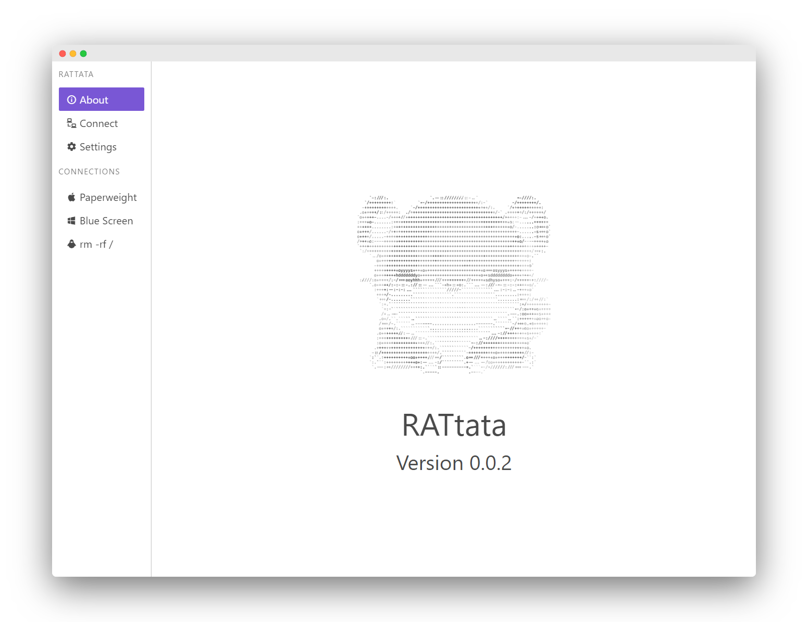

# Project <u>RAT</u>tata


Andrew Wong (z5206677)


_Soo... I built a RAT..._


### a what?

- Remote Administration Tool <!-- .element: class="fragment" data-fragment-index="1" -->
- Remote Access Trojan <!-- .element: class="fragment" data-fragment-index="2" -->


# Demo




## Disclaimer


<!-- .slide: data-background-video="assets/videos/video.mp4" data-background-size="contain" -->


# Technologies

|Node.js|Electron|Vue|
|:--:|:--:|:--:|
|[](https://nodejs.org/)|[](https://electronjs.org/)|[](https://vuejs.org/)|


# Project Completion

## Core Features

|||
|:--|:--:|
|Client|&#x2714;&#xFE0F;|
|Server|&#x2714;&#xFE0F;|
|Relay Server|&#x274C;|


## Additional Features

|||
|:--|:--:|
|Password Authentication|&#x2714;&#xFE0F;|
|Display Streaming|&#x2714;&#xFE0F;|
|Keystroke Logging|&#x2714;&#xFE0F;|
|OS Cross Compatibility|&#x2714;&#xFE0F;|
|Electron GUI|&#x2714;&#xFE0F;|
|Web Camera Capture|&#x274C;|
|Secure Communication|&#x274C;|
|Virus Reserach|&#x2714;&#xFE0F;|


# What went wrong

* NAT Holepunching (Relay server)
* Bugs.


# What went well

* It works (_on my machine&#8482;_)
* Learnt about viruses and malware behaviour
* Wrote an application layer communication protocol
* Electron & Vue.js


# Future
 
```javascript
this.improve();
```

* Write the Relay
* Rewrite the server with a more lower-level language
* Secure the network traffic
* More features...
* Dark theme (important) <!-- .element: class="fragment" data-fragment-index="1" -->


# Project <u>RAT</u>tata


Blog: [Project RATtata](https://featherbear.github.io/UNSW-COMP6441/blog/post/job-application/something_awesome/)  
GitHub: featherbear/[UNSW-COMP6441-RATtata](https://github.com/featherbear/UNSW-COMP6441-RATtata)
